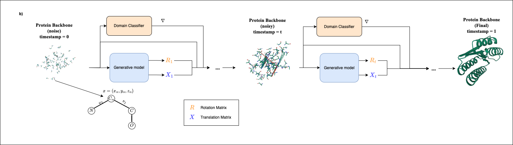

# FlowProt

**FlowProt: Classifier-Guided Flow Matching for Targeted Protein Backbone Generation in the de
novo DNA Methyltransfarase Family**

[](LICENSE)
[](https://www.python.org/)
[]()

---

## Overview

**FlowProt** is a flow-matching generative model guided by a domain classifier for the **targeted generation of protein backbones**, demonstrated on the **de novo DNA methyltransferase (DNMT) family**.

> FlowProt is a **method combining flow matching with classifier guidance** for functional protein design.

- Generates **structurally stable and functionally targeted** protein backbones
- Guided using classifier feedback to focus on **DNMT-like** domains
- Built on the [FrameFlow](https://arxiv.org/abs/2310.05297) architecture


### Abstract
Designing novel proteins with both structural stability and targeted molecular function remains a central challenge in computational biology. While recent generative models such as diffusion and flow-matching offer promising capabilities for protein backbone generation, functional controllability is still limited. In this work, we introduce FlowProt, a classifier-guided flow-matching generative model designed to create protein backbones with domain-specific functional properties. As a case study, we focus on the catalytic domain of human DNA methyltransferase DNMT3A, a 286-residue protein essential in early epigenetic regulation.

FlowProt builds on the FrameFlow architecture, predicting per-residue translation and rotation matrices to reconstruct 3D backbones from noise. A domain classifier, trained to distinguish DNMT proteins from others, guides the model during inference using gradient-based feedback. This enables FlowProt to steer generation toward DNMT-like structures. We evaluate backbone quality using self-consistency metrics (scRMSD, scTM, pLDDT) and domain relevance using ProGReS, sequence similarity, and SAM-binding potential.

FlowProt consistently generates high-confidence structures up to 286 residues—the exact length of DNMT3A—with low scRMSD, high scTM, and strong functional similarity. We further validate our designs through structure-based alignment and cofactor-binding analysis with Chai-1, demonstrating high-confidence SAM-binding regions in the generated models.

To our knowledge, FlowProt is the first method to integrate flow-matching with classifier guidance for domain-specific backbone design. As future work, we aim to assess DNA-binding potential and further refine functional capabilities via molecular dynamics simulations and benchmarking against state-of-the-art protein design models.

---

## Method Summary

<p align="center">
  
</p>

1. Start from random noise  
2. Predict backbone transformations (rotation + translation)  
3. Classifier guides each step toward **DNMT3A-like** structures  
4. Evaluate quality & function (ProteinMPNN → ESMFold → progres)

---

## Results Summary

| Sequence Length | scRMSD ↓ | scTM ↑ | pLDDT ↑ | progres ↑ |
|------------------|----------|--------|----------|------------|
| 286 (DNMT3A)     | 3.10     | 0.86   | 83.12    | 0.53       |

> FlowProt performs best in the mid-length range and excels at 286 residues—the exact length of human DNMT3A.

---

<!--## Repository Structure
<>Work in progress..

---
-->

## Installation
Set up conda environment.

```bash
# Create conda environment with dependencies.
conda env create -f flowprot.yml

# Activate environment
conda activate flowprot
```

---
## Inference

This project uses Hydra for configuration that allows easy and flexible command-line settings. In ```configs/inference.yaml``` you can find the configurations for the inference. 

```yaml
inference:
  name: run_${now:%Y-%m-%d}_${now:%H-%M} # Default name (date-time stamp)
  seed: 123
  ckpt_path: ckpt/flowprot.ckpt # Checkpoint path of the model.
  output_dir: inference_outputs/dnmt-guided-tests-sc/ # Your output directory.

  pmpnn_dir: ./ProteinMPNN/ # ProteinMPNN directory

classifier:
    ckpt_path: classifier_ckpt/classifier.ckpt # Classifier checpoint for guidance.
```

After specified the path to the checkpoints and folders, inference can be started by using the following command.

```bash
python inference.py
```

this command will automatically detect ```configs/inference.yaml``` file and use configurations from that file.

During the inference, we also evaluate samples from FlowProt using ProteinMPNN and ESMFold. By using the same inference procedure as [SE(3) diffusion model with application to protein backbone generation](https://github.com/jasonkyuyim/se3_diffusion), we store the results in the following structure;

```bash
inference_name/
      └── length_60 # Length of the sample.
          ├── sample_0 # Sample id from FlowProt.
          │   ├── bb_traj.pdb # x_{t-1} flow trajectory.
          │   ├── sample.pdb # Sample at the final step.
          │   ├── x0_traj.pdb # x_0 model prediction trajectory
          │   ├── self_consistency # Self consistency results.
          │   │   ├── esmf # ESMFold predictions using ProteinMPNN sequences.
          │   │   │   ├── sample_0.pdb
          │   │   │   ├── ....
          │   │   │   ├── parsed_pdbs.jsonl # Parsed chains for ProteinMPNN
          │   │   ├── sample.pdb
          │   │   ├── sc_results.csv # Self consistency summary metrics CSV
          │   │   └── seqs
          │           └── sample.fa # ProteinMPNN sequences
          └── sample_1
```


## Training

To train the model, you can download (will be available soon [TODO]) our preprocessed dataset. Or you can download and use raw PDB files. 

### Training with the preprocessed dataset

If you download our preprocessed dataset, we will also provide a ```metadata.csv``` file. This file stores some statistical features with file paths to help with IO operations. Note that this file assumes pickled data locations and it may need some fixing on the data paths for your settings.

### Training with raw PDB files

Raw PDB files needs a preprocessing step before training. The preprocessing is done by ```dataset/process_pdb_files.py```. This helper script, preprocesses the raw PDB data into the pickled form.

The training of the model is also controlled by using hydra. The configuration file of the training can be set by ```configs/base.yaml```. 

```yaml
data:
  dataset:
    seed: 9
    max_num_res: 512 # Max number of residues allowed in samples
    min_num_res: 0 # Max number of residues allowed in samples
    samples_per_eval_length: 5
    csv_path: data/metadata.csv # Metadata path
experiment:
  seed: 123
  wandb: # Connection to wandb
    name: experiment-name
    project: project-name
trainer:
  max_epochs: 300 # Maximum number of epochs
  log_every_n_steps: 1
checkpointer:
  dirpath: ckpt/${experiment.wandb.project}/${experiment.wandb.name} # Checkpoint dir
  save_last: true # Flag value to save model on last epoch
  save_top_k: 3 # Checkpoint best 3 model weights
  monitor: valid/non_coil_percent # Set monitor metric
  mode: max
```

Then the model is trained by ```train.py``` with the following command;

```bash
python train.py
```

this command will automatically detect the ```base.yaml``` file and apply configurations to the training.  

The training can be monitored via wandb with the given settings in the configuration file. During/after the training, outputs will be written in the path given with ```checkpointer.dirpath```. The checkpoint folder will have the following structure;

```bash
checkpoint_dir/
      ├── config.yaml # The training config file for the run.
      ├── last.ckpt # Model weights from the last step.
      ├── epoch={}-step={}.ckpt # Top n checkpoints.
      ├── ...
      └── sample.pdb # Validation samples. (can be more than one)
```

---

## Contact

Feel free to open an issue or reach out:  
📧 alibaran [at] tasdemir.us

---

## References

- FrameFlow (Yim et al. 2023)  
- ESMFold, ProteinMPNN, and progres

---

## License

Copyright (C) 2025 HUBioDataLab

This program is free software: you can redistribute it and/or modify it under the terms of the GNU General Public License as published by the Free Software Foundation, either version 3 of the License, or (at your option) any later version.

This program is distributed in the hope that it will be useful, but WITHOUT ANY WARRANTY; without even the implied warranty of MERCHANTABILITY or FITNESS FOR A PARTICULAR PURPOSE. See the GNU General Public License for more details.

You should have received a copy of the GNU General Public License along with this program. If not, see http://www.gnu.org/licenses/.